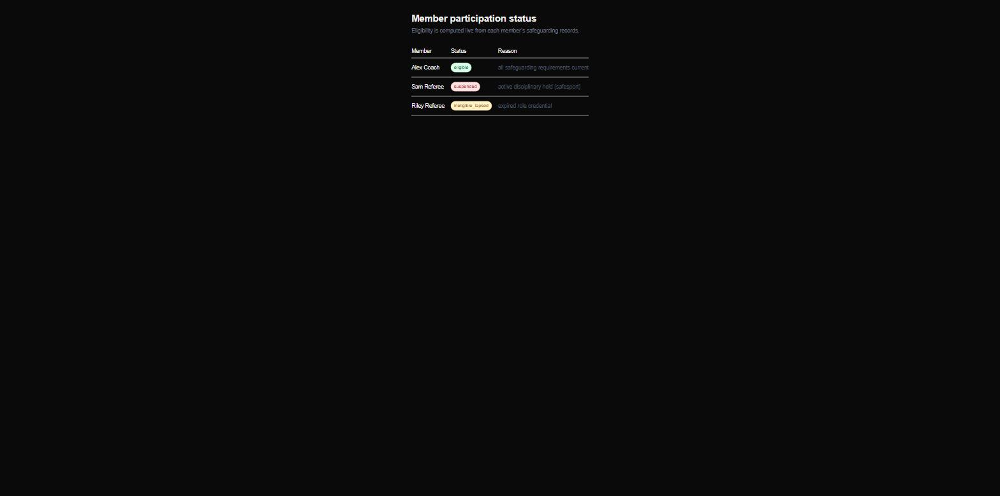

# Learning Center Reference

> **Status: a working vertical slice, not a full product.** What runs today is
> the safeguarding-eligibility engine end to end — Postgres → Go API → Next.js
> — for a soccer-federation Learning Center. Everything else (courses UI,
> Auth0, Sanity, i18n, event sourcing) is **planned** and clearly labeled so
> below. This repo is honest about that line on purpose.

> ⚠️ **Independent portfolio project — not affiliated with, endorsed by, or
> containing data from U.S. Soccer or any member organization. All names and
> records are fictional.**

The interesting part is not CRUD: **eligibility to participate is a *derived*
value.** It is never stored — it is recomputed on every request from a
member's background-check expiry, SafeSport-training expiry, role credential
(coaching license / referee recertification), and any active disciplinary
hold, and it flips automatically the moment any input lapses. The rule lives
in one pure, table-driven-tested Go function; the API and UI just deliver it.

## Quick start (no .env needed)

```sh
git clone https://github.com/nick-bellows/learning-center-reference
cd learning-center-reference
docker compose up --build
```

Then open **http://localhost:3000/members** — three synthetic members,
computed live, one of each status:



| Member | Status | Why |
| --- | --- | --- |
| Alex Coach | `eligible` | background check, SafeSport, and coaching license all current |
| Sam Referee | `suspended` | an **active disciplinary hold** overrides current credentials |
| Riley Referee | `ineligible_lapsed` | referee **recertification expired** — current checks don't save you |

API directly: `curl localhost:8080/v1/members/33333333-3333-3333-3333-333333333333/eligibility`
· `/health` pings the database (503 when it's down). The API applies its
embedded migrations and the idempotent synthetic seed on startup.

## Implemented vs planned

| Piece | Status |
| --- | --- |
| Domain rule: derived eligibility (holds → credentials → grace), inclusive expiry dates, boundary-tested | **implemented** |
| Go API: chi router, request-validated ids (400), 404 vs 500 separation, HTTP timeouts, graceful shutdown, DB-aware `/health` | **implemented** |
| PostgreSQL: 4 versioned migrations, embedded startup migration runner, synthetic idempotent seed | **implemented** |
| Next.js 16 web: server-component members page rendering live statuses | **implemented** |
| Docker: distroless non-root API image, standalone non-root web image, one-command compose | **implemented** |
| CI: Go vet/tests **with a real Postgres**, govulncheck, web lint/build, and an e2e job that runs the quickstart verbatim and asserts all three statuses | **implemented** |
| Course delivery UI, enrollment flows (schema exists; no UI/endpoints) | planned |
| Auth0 (OIDC) login and roles | planned |
| Sanity CMS course content | planned |
| Event-sourced learner progress | planned |
| `es` locale, WCAG 2.1 AA test gate, OpenAPI spec | planned |
| Cloud deployment | planned (`docs/deploy.md` documents the Fly.io path) |

## The domain rule, in one paragraph

A hold beats everything: any active disciplinary hold → `suspended`. Otherwise
every required credential must be on file and current: SafeSport and a
background check always; a role credential for members holding a
credential-requiring role (coach, referee), where the **weakest link wins**
across roles. Expiry dates are **inclusive** — a credential expiring
`2027-06-01` is valid through that entire day (UTC) and flips at midnight
after, with an optional grace window; the boundary is unit-tested, not
assumed. See `api/internal/safeguarding/eligibility.go` and
`docs/domain-model.md`.

## Repository map

```text
docs/     Domain model (read first), ADRs, deploy notes
api/      Go service: httpapi (router), safeguarding (the rule), store (pgx),
          dbsetup (embedded migration runner), migrations/
web/      Next.js 16 + TypeScript + Tailwind members page
db/       Synthetic seed (labeled, idempotent)
```

## Milestones

- [x] **M0 — Foundation:** repo scaffold, compose, CI green
- [x] **M1 — Domain model:** `docs/domain-model.md` written before any schema
- [x] **M2 — Safeguarding vertical slice:** db → API → web, e2e-tested in CI *(this is where the repo is now)*
- [ ] **M3 — Courses & enrollment:** course player, progress, admin roster
- [ ] **M4 — Release:** Auth0, certificates, `es`, WCAG gate, live demo

## Disclaimer

Educational reference implementation. Synthetic data only. Not affiliated
with, endorsed by, or containing data from any soccer federation or member
organization.
