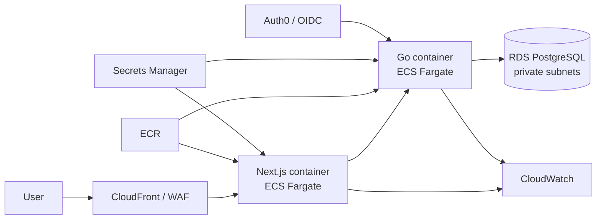

# AWS Deployment Pattern (Design Only)

> **Evidence boundary:** no AWS resources were provisioned and no production deployment is
> claimed. This is a cost/security review artifact for a future deployment, not proof of
> cloud operation.

## Proposed bounded architecture

The web application is server-rendered and performs mutations through Server Actions, so it
is modeled as a container rather than a static S3 site. The API and database stay private
except for the application ingress boundary. The existing images are the deployment units;
no Kubernetes layer is justified for two services.

## Required controls before provisioning

1. Set an explicit monthly budget and billing alerts; estimate RDS, NAT/data transfer,
   load-balancer, logging, and container runtime costs.
2. Separate staging and production accounts/configuration. Use least-privilege task roles and
   never place database or OIDC secrets in image layers or repository variables.
3. Place RDS in private subnets, require TLS in transit, enable encryption/backups, and test
   restore—not merely backup creation.
4. Run migrations as a controlled one-off task; do not allow every horizontally scaled API
   instance to race startup migrations.
5. Configure `AUTH_MODE=oidc`, issuer, and audience. The local demo adapter must not be
   enabled in an internet-accessible environment.
6. Add organization-scoped authorization, rate limits, audit retention, alerting, and a data
   classification/retention review before accepting any real user data.
7. Define health alarms, structured-log retention, error-rate/latency metrics, rollback, and
   an incident runbook.

## Why not deploy this now?

A public deployment would add cost, credentials, and an externally reachable attack surface
without completing hosted login or organization tenancy. Local Compose plus CI currently
proves the implemented behavior more honestly. Provisioning should follow—not precede—the
identity, cost, and security review above.
